# ShubhPrasang - Event Management Portal

## Team Members
- Nikunj Patel
- Udit Avaiya
- Deep Patel
- Akash Singh

## Date
12 December 2023

## Project Description
"ShubhPrasang" is an event management portal developed with the MERN stack and integrated Stripe payment gateway. It simplifies event planning by allowing users to explore, book venues, and manage events seamlessly.

## Technology Used
### Front-end:
- React, HTML, CSS, JavaScript

### Back-end:
- Node.js, Express.js, MongoDB, Mongoose, Stripe

### Version Control:
- GitHub

## Client Side Features
- User registration and login with JWT tokens
- Event creation and management
- Venue exploration with details
- Secure booking and checkout using Stripe
- Profile management and email verification
- Personalized dashboard and push notifications

## Admin Side Features
- Admin login and dashboard overview
- CRUD operations for venue and user management
- Organizer oversight and feedback management
- Contact Us and About Us pages

## Difficulties Faced and Solutions
- Addressed dependency issues and ensured compatibility.
- Integrated Stripe after adjusting node and react versions.
- Solved merging problems in the GitHub repository by pulling code before committing.

## Future Implementations
- Showcase venue categories during registration.
- Implement a section for highlighting new venues.
- Enable push notifications for order updates.
- Integrate a coupon system for discounts during checkout.

## GitHub
- GitHub Link: [https://github.com/udit19981/ShubhPrasang](https://github.com/udit19981/ShubhPrasang)

## Screenshots
1) Login
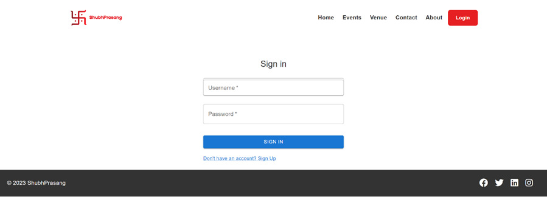

2) Signup
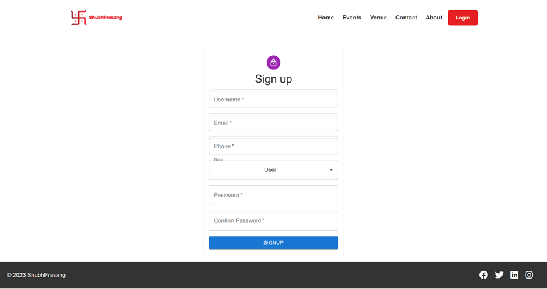

3) Home
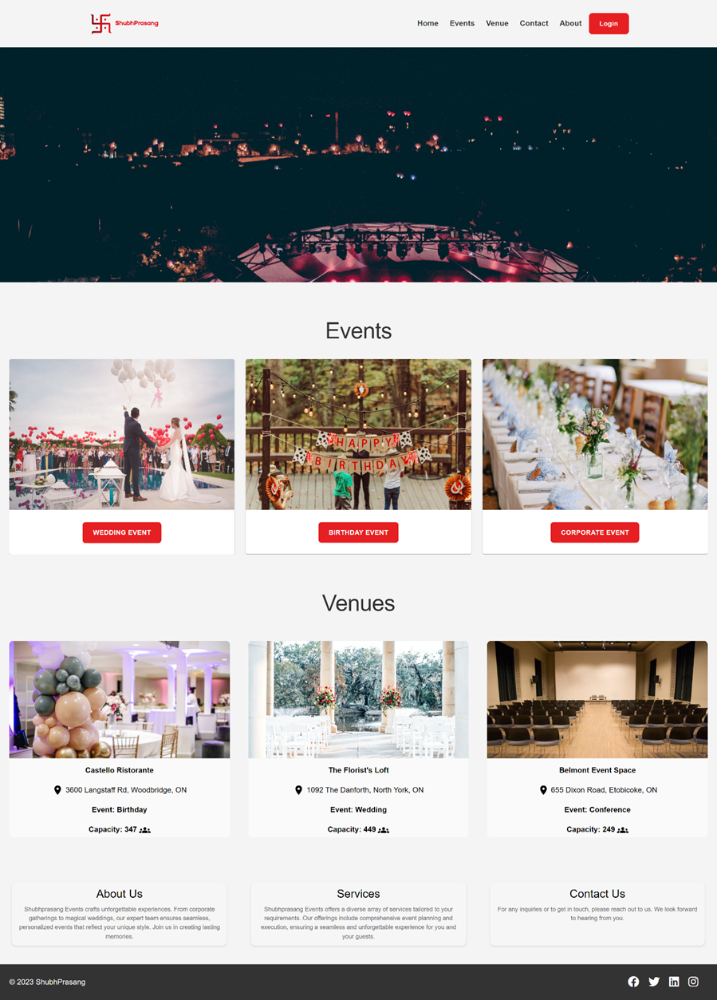

4) Events
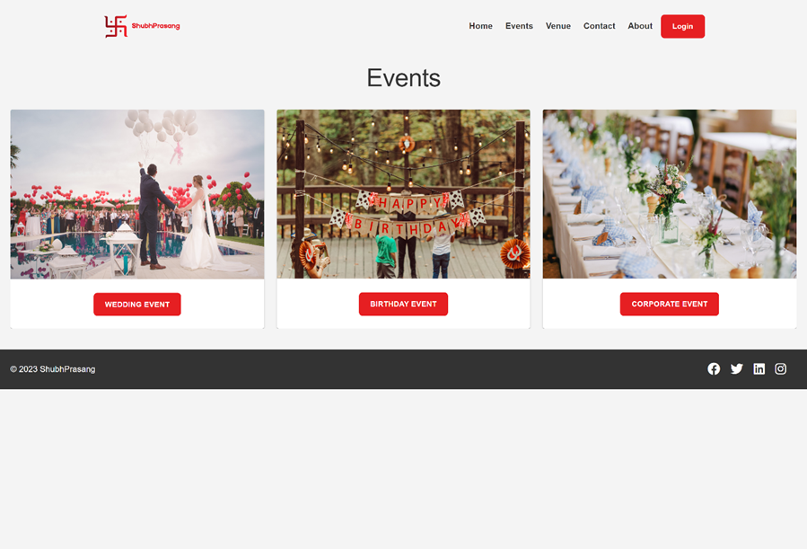
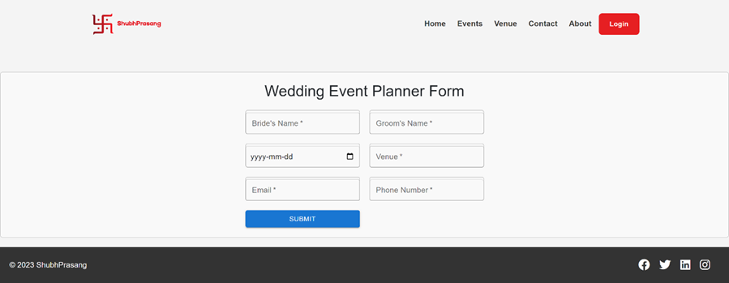

5) Venue

6) Contact
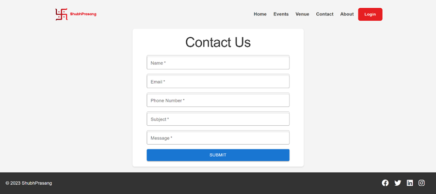

7) About
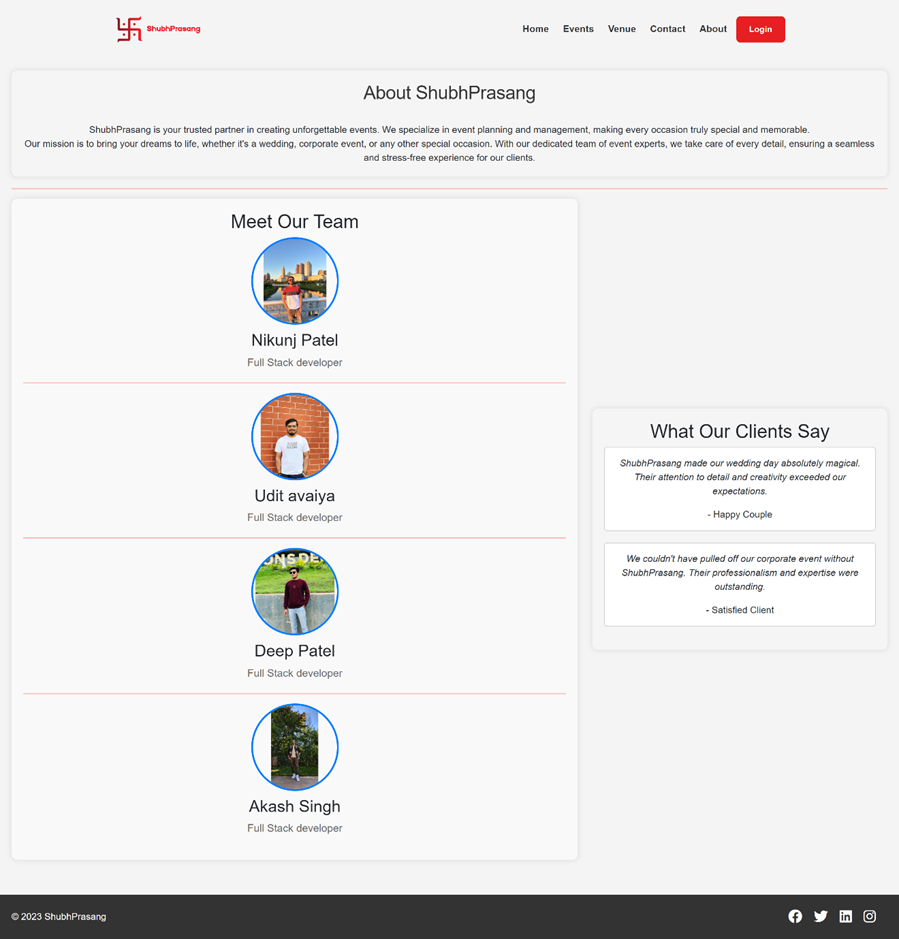

8) Checkout
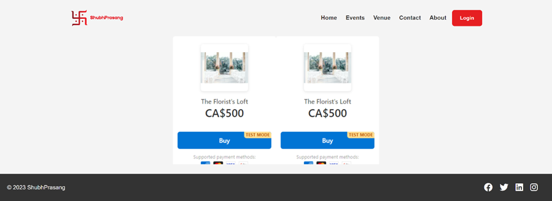

9) Checkout 2 (Stripe payment)
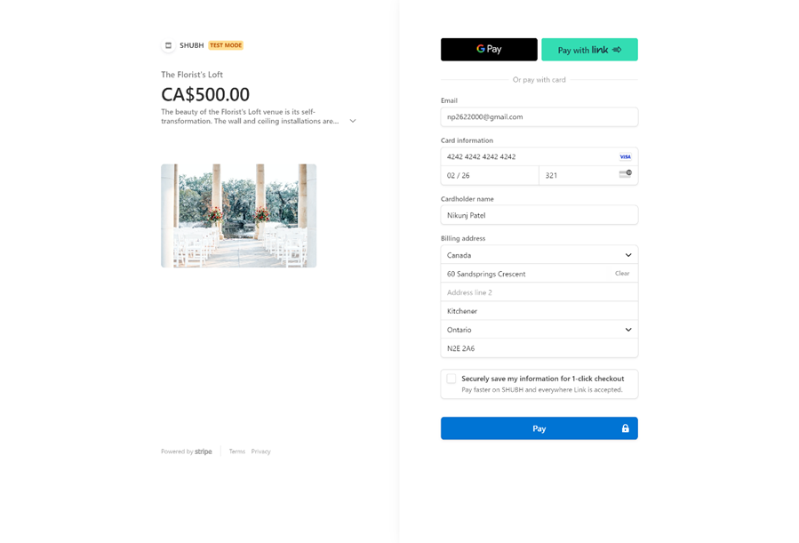
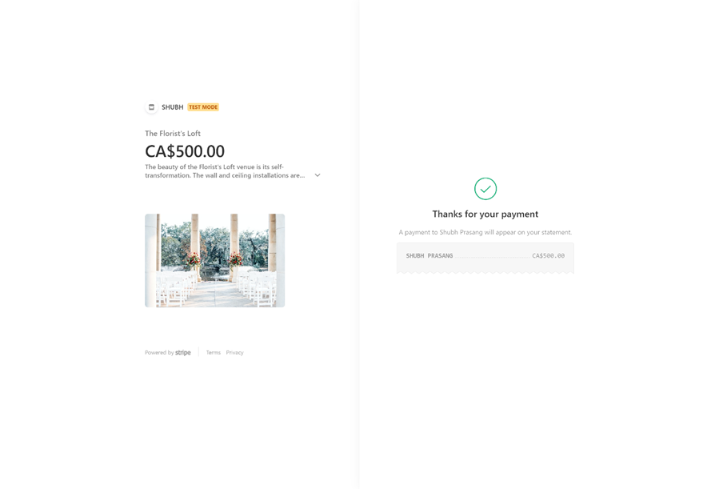

10) Admin Dashboard
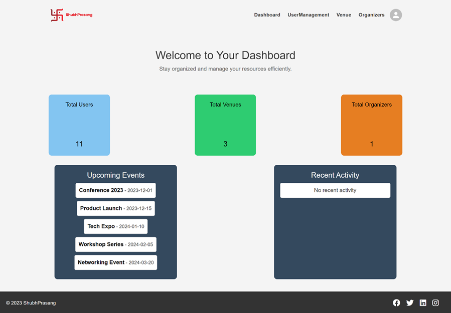

11) Venue Management
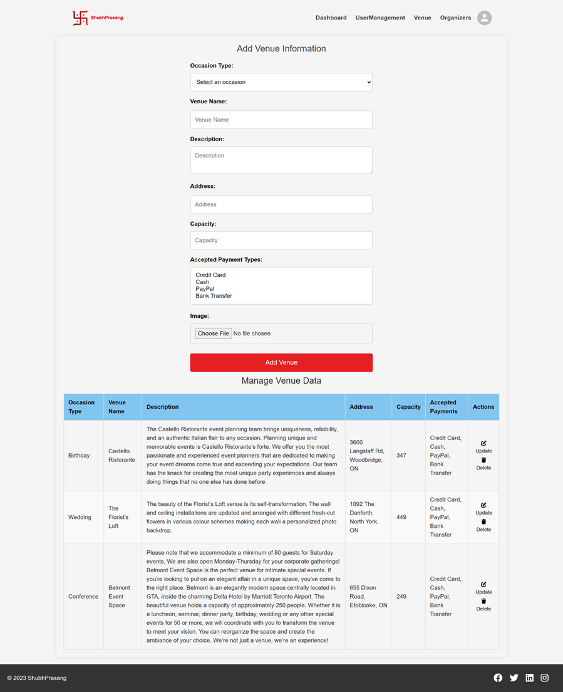

12) User Management
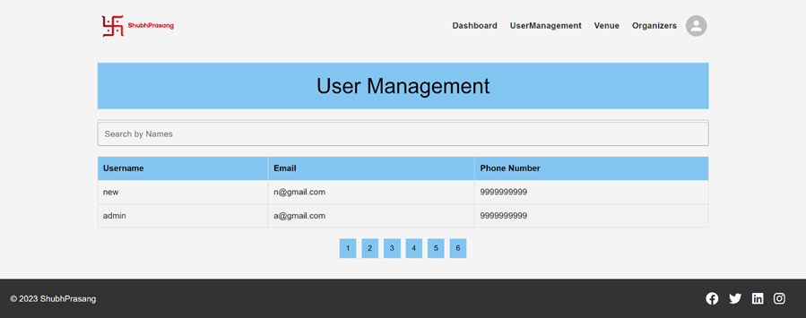

13) Organizer Management
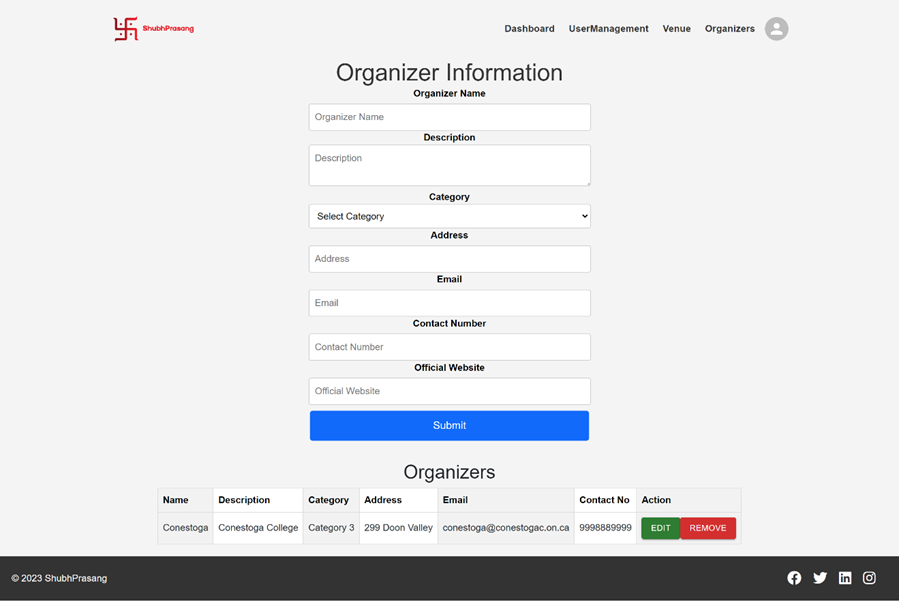

## Accessibility Features
- Tested with the Wave extension to ensure accessibility compliance.
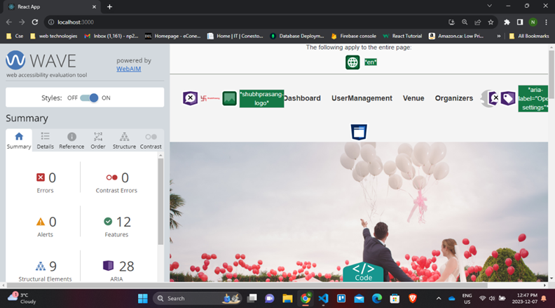